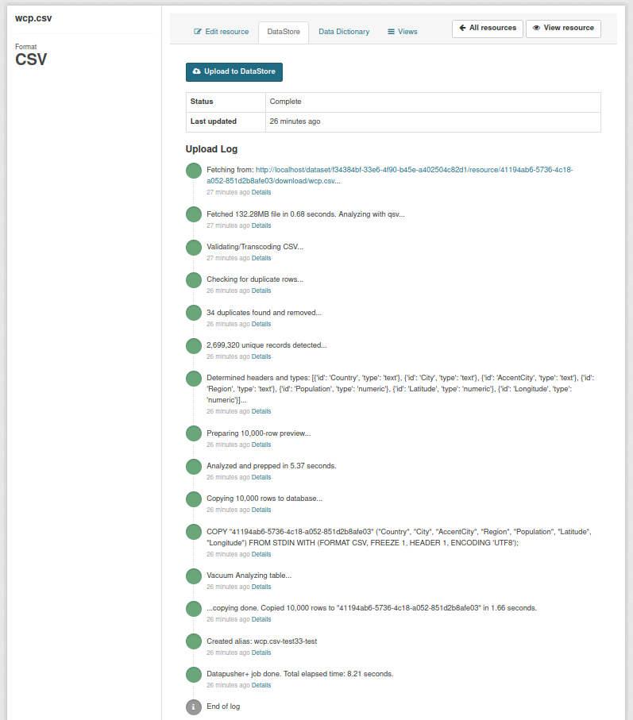
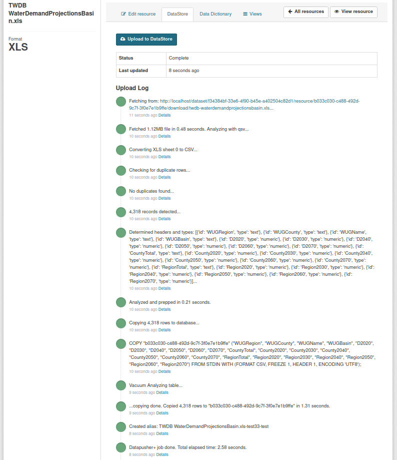

[CKAN Service Provider]: https://github.com/ckan/ckan-service-provider
[Messytables]: https://github.com/okfn/messytables
[qsv]: https://github.com/jqnatividad/qsv#qsv-ultra-fast-csv-data-wrangling-toolkit

# DataPusher+

DataPusher+ is a fork of [Datapusher](https://github.com/ckan/datapusher) that combines the speed and robustness of
[ckanext-xloader](https://github.com/ckan/ckanext-xloader) with the data type guessing of Datapusher.

Datapusher+ is built using [CKAN Service Provider][], with [Messytables] replaced by [qsv].

[TNRIS](https://tnris.org)/[TWDB](https://www.twdb.texas.gov/) provided the use cases that informed and supported the development
of Datapusher+, specifically, to support a [Resource-first upload workflow](docs/RESOURCE_FIRST_WORKFLOW.md#Resource-first-Upload-Workflow).

For a more detailed overview, see the [CKAN Monthly Live Jan 2023 presentation](https://docs.google.com/presentation/d/e/2PACX-1vT0BfmrrtaEINRGg4UI_m7B02_X6HlFr4yN_DXmgX9goVtgu2DNmZjl-SowL9ZA2ibQhDjScRRJh95q/pub?start=false&loop=false&delayms=3000).

It features:

* **"Bullet-proof", ultra-fast data type inferencing with qsv**

  Unlike [Messytables][] which scans only the the first few rows to guess the type of
  a column, [qsv][] scans the entire table so its data type inferences are guaranteed[^1].

  Despite this, qsv is still exponentially faster even if it scans the whole file, not
  only inferring data types, it also calculates some descriptive statistics as well. For example,
  [scanning a 2.7 million row, 124MB CSV file for types and stats took 0.16 seconds](https://github.com/jqnatividad/qsv/blob/master/docs/whirlwind_tour.md#a-whirlwind-tour)[^2].

  It is very fast as qsv is written in [Rust](https://www.rust-lang.org/), is multithreaded,
  and uses all kinds of [performance techniques](https://github.com/jqnatividad/qsv/blob/master/docs/PERFORMANCE.md#performance-tuning)
  especially designed for data-wrangling.

* **Exponentially faster loading speed**

  Similar to xloader, we use PostgreSQL COPY to directly pipe the data into the datastore,
  short-circuiting the additional processing/transformation/API calls used by Datapusher.

  But unlike xloader, we load everything using the proper data types and not as text, so there's
  no need to reload the data again after adjusting the Data Dictionary, as you would with xloader.

* **Production-ready Robustness**

  In production, the number one source of support issues is Datapusher - primarily, because of
  data quality issues and Datapusher's inability to correctly infer data types, gracefully handle
  errors[^3], and provide the Data Publisher actionable information to correct the data.

  Datapusher+'s design directly addresses all these issues.

* **More informative datastore loading messages**

  Datapusher+ messages are designed to be more verbose and actionable, so the data publisher's
  user experience is far better and makes it possible to have a resource-first upload workflow.

* **Extended preprocessing with qsv**

  Apart from bullet-proof data type inferences, qsv is leveraged by Datapusher+ to convert Excel & ODS files;
  count the number of rows; transcode to UTF-8 if required; validate if a CSV conforms to the [RFC 4180 standard](https://datatracker.ietf.org/doc/html/rfc4180); sanitize header names so they are always valid Postgres column identifers;
  optionally create a preview subset and optionally deduplicate rows.

  Future versions of Datapusher+ will further leverage qsv's 80+ commands to do additional
  preprocessing, data-wrangling and validation. The Roadmap is available [here](https://github.com/dathere/datapusher-plus/issues/5).
  Ideas, suggestions and your feedback are most welcome!

[^1]: [Why use qsv instead of a "proper" python data analysis library like pandas?](https://github.com/dathere/datapusher-plus/discussions/15)
[^2]: It takes 0.16 seconds with an index to run `qsv stats` against the [qsv whirlwind tour sample file](https://raw.githubusercontent.com/wiki/jqnatividad/qsv/files/wcp.zip) on a Ryzen 4800H (8 physical/16 logical cores) with 32 gb memory and a 1 TB SSD.
Without an index, it takes 1.3 seconds.
[^3]: Imagine you have a 1M row CSV, and the last row has an invalid value for a numeric column (e.g. "N/A" instead of a number).
      After spending hours pushing the data very slowly, legacy datapusher will abort on the last row and the ENTIRE job is invalid.
      Ok, that's bad, but what makes it worse is that the old table has been deleted already, and Datapusher doesn't tell you what
      caused the job to fail! YIKES!!!!

## Development Installation

Datapusher+ is a drop-in replacement for Datapusher, so it's installed the same way.

1. Install the required packages.

    ```bash
    sudo apt install python3-virtualenv python3-dev python3-pip python3-wheel build-essential libxslt1-dev libxml2-dev zlib1g-dev git libffi-dev libpq-dev
    ```

2. Create a virtual environment for Datapusher+ using at least python 3.8.

    ```bash
    cd /usr/lib/ckan
    sudo python3.8 -m venv dpplus_venv
    sudo chown -R $(whoami) dpplus_venv
    . dpplus_venv/bin/activate
    cd dpplus_venv
    ```

    > ℹ️ **NOTE:** DP+ requires at least python 3.8 as it makes extensive use of new capabilities introduced in 3.7/3.8
    > to the [subprocess module](https://docs.python.org/3.8/library/subprocess.html).
    > If you're using Ubuntu 18.04 or earlier, follow the procedure below to install python 3.8:
    >
    > ```bash
    > sudo add-apt-repository ppa:deadsnakes/ppa
    > # we use 3.8 here, but you can get a higher version by changing the version suffix of the packages below
    > sudo apt install python3.8 python3.8-venv python3.8-dev
    > # install additional dependencies
    > sudo apt install build-essential libxslt1-dev libxml2-dev zlib1g-dev git libffi-dev
    > ```
    >
    > Note that DP+ still works with CKAN<=2.8, which uses older versions of python.

3. Get the code.

    ```bash
    git clone --branch 0.10.1 https://github.com/datHere/datapusher-plus
    cd datapusher-plus
    ```

4. Install the dependencies.

    ```bash
    pip install wheel
    pip install -r requirements-dev.txt
    pip install -e .
    ```

5. Install [qsv](https://github.com/jqnatividad/qsv).

    [Download the appropriate precompiled binaries](https://github.com/jqnatividad/qsv/releases/latest) for your platform and copy
    it to the appropriate directory, e.g. for Linux:

    ```bash
    wget https://github.com/jqnatividad/qsv/releases/download/0.87.1/qsv-0.87.1-x86_64-unknown-linux-gnu.zip
    unzip qsv-0.87.1-x86_64-unknown-linux-gnu.zip
    rm qsv-0.87.1-x86_64-unknown-linux-gnu.zip
    sudo mv qsv* /usr/local/bin
    ```

    Alternatively, if you want to install qsv from source, follow
    the instructions [here](https://github.com/jqnatividad/qsv#installation). Note that when compiling from source,
    you may want to look into the [Performance Tuning](https://github.com/jqnatividad/qsv#performance-tuning)
    section to squeeze even more performance from qsv.

    Also, if you get glibc errors when starting qsv, your Linux distro may not have the required version of the GNU C Library
    (This will be the case when running Ubuntu 18.04 or older).
    If so, use the `unknown-linux-musl.zip` archive as it is statically linked with the MUSL C Library.

    If you already have qsv, update it to the latest release by using the --update option.

    `qsvdp --update`

    > ℹ️ **NOTE:** qsv is a general purpose CSV data-wrangling toolkit that gets regular updates. To update to the latest version, just run
    qsv with the `--update` option and it will check for the latest version and update as required.

6. Configure the Datapusher+ database.

   Make sure to create the `datapusher` PostgreSQL user and the `datapusher_jobs` database
   (see [DataPusher+ Database Setup](#datapusher-database-setup)).

7. Copy the `datapusher/dot-env.template` to `datapusher/.env` and [modify your configuration](#datapusher-configuration).

    ```bash
    cd datapusher
    cp dot-env.template .env
    # configure your installation as required
    nano .env
    ```

8. Run Datapusher+.

    ```bash
    python3 main.py config.py
    ```

    By default, DP+ should be running at the following port:

    http://localhost:8800/

## Production deployment

### Manual installation

These instructions assume you already have CKAN installed on this server in the
default location described in the CKAN install documentation (`/usr/lib/ckan/default`). If this is the case,
you should be able to run the following commands directly, if not you will need to adapt the previous path to
your needs.

These instructions set up the DataPusher web service on
[uWSGI](https://uwsgi-docs.readthedocs.io/en/latest/) running on port 8800, but
can be easily adapted to other WSGI servers like Gunicorn. You'll probably need
to set up Nginx as a reverse proxy in front of it and something like Supervisor
to keep the process up.


    # Install requirements for DataPusher+. Be sure to have at least Python 3.8
    sudo apt install python3-virtualenv python3-dev python3-pip python3-wheel build-essential libxslt1-dev libxml2-dev zlib1g-dev git libffi-dev libpq-dev

    # Install qsv, if required
    wget https://github.com/jqnatividad/qsv/releases/download/0.87.1/qsv-0.87.1-x86_64-unknown-linux-gnu.zip -P /tmp
    unzip /tmp/qsv-0.87.1-x86_64-unknown-linux-gnu.zip -d /tmp
    rm /tmp/qsv-0.87.1-x86_64-unknown-linux-gnu.zip
    sudo mv /tmp/qsv* /usr/local/bin

    # if qsv is already installed, be sure to update it to the latest release
    sudo qsvdp --update
    
    # find out the locale settings
    locale

    # Set Locales (only do this if the current locale LANG is not "en_US.UTF-8")
    export LC_ALL="en_US.UTF-8"
    export LC_CTYPE="en_US.UTF-8"
    sudo dpkg-reconfigure locales

    cd /usr/lib/ckan

    # Create a virtualenv for DataPusher+. DP+ requires at least python 3.8.
    sudo python3.8 -m venv /usr/lib/ckan/dpplus_venv
    sudo chown -R $(whoami) dpplus_venv

    # install datapusher-plus in the virtual environment
    . /usr/lib/ckan/dpplus_venv/bin/activate
    pip install wheel
    pip install datapusher-plus

    # create an .env file and tune DP+ settings. Tune the uwsgi.ini file as well
    sudo mkdir -p /etc/ckan/datapusher-plus
    sudo curl https://raw.githubusercontent.com/dathere/datapusher-plus/master/datapusher/dot-env.template -o /etc/ckan/datapusher-plus/.env
    sudo curl https://raw.githubusercontent.com/dathere/datapusher-plus/master/deployment/datapusher-uwsgi.ini -o /etc/ckan/datapusher-plus/uwsgi.ini

    # Be sure to initialize the database if required. (See Database Setup section below)
    # Be sure to the .env file have the right connect strings!

    # Create a user to run the web service (if necessary)
    sudo addgroup www-data
    sudo adduser -G www-data www-data

At this point you can run DataPusher+ with the following command:

    /usr/lib/ckan/dpplus_venv/bin/uwsgi --enable-threads -i /etc/ckan/datapusher-plus/uwsgi.ini

You might need to change the `uid` and `guid` in the `uwsgi.ini` file when using a different user.

To deploy it using supervisor:

    sudo curl https://raw.githubusercontent.com/dathere/datapusher-plus/master/deployment/datapusher-uwsgi.conf -o /etc/supervisor/conf.d/datapusher-uwsgi.conf
    sudo service supervisor restart

### Package deployment (WIP)
As Datapusher+ is quite involved as evinced by the above procedure, a containerized package installation 
will make it far easier not only to deploy DP+ to production, but also to experiment with.

The upcoming DP+ package will also expose additional features and administrative interface to manage
not only Datapusher+ jobs, but also to manage the CKAN Datastore.


## Configuring


### CKAN Configuration

Add `datapusher` to the plugins in your CKAN configuration file
(generally located at `/etc/ckan/default/ckan.ini`):

    ckan.plugins = <other plugins> datapusher

In order to tell CKAN where this webservice is located, the following must be
added to the `[app:main]` section of your CKAN configuration file :

    ckan.datapusher.url = http://127.0.0.1:8800/

There are other CKAN configuration options that allow to customize the CKAN - DataPusher
integration. Please refer to the [DataPusher Settings](https://docs.ckan.org/en/latest/maintaining/configuration.html#datapusher-settings) section in the CKAN documentation for more details.

> ℹ️ **NOTE:** DP+ recognizes some additional TSV and spreadsheet subformats - `xlsm` and `xlsb` for Excel Spreadsheets,
> and `tab` for TSV files. To process these subformats, set `ckan.datapusher.formats` as follows in your CKAN.INI file:
>
>```
> ckan.datapusher.formats = csv xls xlsx xlsm xlsb tsv tab application/csv application/vnd.ms-excel application/vnd.openxmlformats-officedocument.spreadsheetml.sheet ods application/vnd.oasis.opendocument.spreadsheet
>```
>
>and add this entry to your CKAN's `resource_formats.json` file.
>
>```
> ["TAB", "Tab Separated Values File", "text/tab-separated-values", []],
>```


### DataPusher+ Configuration

The DataPusher+ instance is configured in the `.env` file located in the working directory of DP+
(`/etc/ckan/datapusher-plus` when running a production deployment. The root of the datapusher-plus
source directory when running a development installation.)

See [dot-env.template](datapusher/dot-env.template) for a summary of configuration options available.


### DataPusher+ Database Setup

DP+ requires a dedicated PostgreSQL account named `datapusher` to connect to the CKAN Datastore.

To create the `datapusher` user and give it the required privileges to the `datastore_default` database:

```
su - postgres
psql -d datastore_default
CREATE ROLE datapusher LOGIN PASSWORD 'YOURPASSWORD';
GRANT CREATE, CONNECT, TEMPORARY, SUPERUSER ON DATABASE datastore_default TO datapusher;
GRANT SELECT, INSERT, UPDATE, DELETE, TRUNCATE ON ALL TABLES IN SCHEMA public TO datapusher;
\q
```

DP+ also requires its own job_store database to keep track of all the DP+ jobs. In the original Datapusher,
this was a sqlite database by default. Though DP+ can still use a sqlite database, we are discouraging its use.

To setup the `datapusher_jobs` database and its user:

    sudo -u postgres createuser -S -D -R -P datapusher_jobs
    sudo -u postgres createdb -O datapusher_jobs datapusher_jobs -E utf-8

## Usage

Any file that has one of the supported formats (defined in [`ckan.datapusher.formats`](https://docs.ckan.org/en/latest/maintaining/configuration.html#ckan-datapusher-formats)) will be attempted to be loaded
into the DataStore.

You can also manually trigger resources to be resubmitted. When editing a resource in CKAN (clicking the "Manage" button on a resource page), a new tab named "DataStore" will appear. This will contain a log of the last attempted upload and a button to retry the upload.




### Command line

Run the following command to submit all resources to datapusher, although it will skip files whose hash of the data file has not changed:

    ckan -c /etc/ckan/default/ckan.ini datapusher resubmit

On CKAN<=2.8:

    paster --plugin=ckan datapusher resubmit -c /etc/ckan/default/ckan.ini

To Resubmit a specific resource, whether or not the hash of the data file has changed::

    ckan -c /etc/ckan/default/ckan.ini datapusher submit {dataset_id}

On CKAN<=2.8:

    paster --plugin=ckan datapusher submit <pkgname> -c /etc/ckan/default/ckan.ini


## License

This material is copyright (c) 2020 Open Knowledge Foundation and other contributors

It is open and licensed under the GNU Affero General Public License (AGPL) v3.0
whose full text may be found at:

http://www.fsf.org/licensing/licenses/agpl-3.0.html
